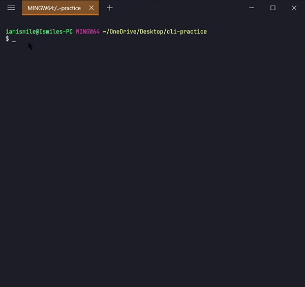

  

    
  

   
  <h6>Learn Basic UNIX Commands</h6>
  

    <a href="https://github.com/iamismile">Ismile Hossain</a>
     
    Follow me on <a href="https://twitter.com/whoisismile">Twitter</a>, <a href="https://www.linkedin.com/in/iamismile/">LinkedIn</a>.
  

## 💻 Command Line:

**_The command line is a tool or interface for interacting with a computer using only text rather than the mouse._**

Command-Line is an essential tool for software development. We can execute a wide variety of programs on our computer through this. In this tutorial, we are going to learn the necessary UNIX commands for development.

> **UNIX** command is a type of command that is used in LINUX and macOS.

**To run some basic UNIX command in windows you can download Git Command Line Interface from [Git SCM](https://git-scm.com/).**

---

## 🔰 Getting Started:

✨ Let's start to learn (can use it as a reference guide)🏃‍♂️🏃‍♂️🏃‍♂️...

#### ✔ Check the Current Directory ➡ `pwd`:

On the command line, it's important to know the directory we are currently working on. For that, we can use `pwd` command.

It shows that I'm working on my **Desktop** directory.

#### ✔ Display List of Files ➡ `ls`:

To see the list of files and directories in the current directory use `ls` command in your CLI.

Shows all of my files and directories of my **Desktop** directory.

- To show the contents of a directory pass the directory name to the `ls` command i.e. `ls directory_name`.
- Some useful `ls` command options:-

| Option |                      Description                       |
| ------ | :----------------------------------------------------: |
| ls -a  | list all files including hidden file starting with '.' |
| ls -l  |               list with the long format                |
| ls -la |        list long format including hidden files         |

####✔ Create a Directory ➡ `mkdir`:
We can create a new folder using the `mkdir` command. To use it type `mkdir folder_name`.

Use `ls` command to see the directory is created or not.

I created a **cli-practice** directory in my working directory i.e. **Desktop** directory.

#### ✔ Move Between Directories ➡ `cd`:

It's used to change directory or to move other directories. To use it type `cd directory_name`.

Can use `pwd` command to confirm your directory name.

Changed my directory to the **cli-practice** directory. And the rest of the tutorial I'm gonna work within this directory.

#### ✔ Parent Directory ➡ `..`:

We have seen `cd` command to change directory but if we want to move back or want to move to the parent directory we can use a special symbol `..` after `cd` command, like `cd ..`

#### ✔ Create Files ➡ `touch`:

We can create an empty file by typing `touch file_name`. It's going to create a new file in the current directory (the directory you are currently in) with your provided name.

I created a **hello.txt** file in my current working directory. Again you can use `ls` command to see the file is created or not.

Now open your **hello.txt** file in your text editor and write **_Hello Everyone!_** into your **hello.txt** file and save it.

#### ✔ Display the Content of a File ➡ `cat`:

We can display the content of a file using the `cat` command. To use it type `cat file_name`.

Shows the content of my **hello.txt** file.

#### ✔ Move Files & Directories ➡ `mv`:

To move a file and directory, we use `mv` command.

By typing `mv file_to_move destination_directory`, you can move a file to the specified directory.

By entering `mv directory_to_move destination_directory`, you can move all the files and directories under that directory.

Before using this command, we are going to create two more directories and another **txt** file in our **cli-practice** directory.

`mkdir html css touch bye.txt`

Yes, we can use multiple directories & files names one after another to create multiple directories & files in one command.

Moved my **bye.txt** file into my **css** directory and then moved my **css** directory into my **html** directory.

#### ✔ Rename Files & Directories ➡ `mv`:

`mv` command can also be used to rename a file and a directory.

You can rename a file by typing `mv old_file_name new_file_name` & also rename a directory by typing `mv old_directory_name new_directory_name`.

Renamed my **hello.txt** file to the **hi.txt** file and **html** directory to the **folder** directory.

#### ✔ Copy Files & Directories ➡ `cp`:

To do this, we use the `cp` command.

- You can copy a file by entering `cp file_to_copy new_file_name`.

Copied my **hi.txt** file content into **hello.txt** file. For confirmation open your **hello.txt** file in your text editor.

- You can also copy a directory by adding the `-r` option, like `cp -r directory_to_copy new_directory_name`.

_The `-r` option for "recursive" means that it will copy all of the files including the files inside of subfolders._

Here I copied all of the files from the **folder** to **folder-copy**.

#### ✔ Remove Files & Directories ➡ `rm`:

To do this, we use the `rm` command.

- To remove a file, you can use the command like `rm file_to_remove`.

Here I removed my **hi.txt** file.

- To remove a directory, use the command like `rm -r directory_to_remove`.

I removed my **folder-copy** directory from my **cli-practice** directory i.e. current working directory.

#### ✔ Clear Screen ➡ `clear`:

Clear command is used to clear the terminal screen.

#### ✔ Home Directory ➡ `~`:

The Home directory is represented by `~`. The Home directory refers to the base directory for the user. If we want to move to the Home directory we can use `cd ~` command. Or we can only use `cd` command.

---

### 🛠 Tools I Used:-

1. [Fluent Terminal](https://github.com/felixse/FluentTerminal)
2. [Git Bash Shell](https://git-scm.com)

---

Thanks for reading and stay tuned.🙂👋
